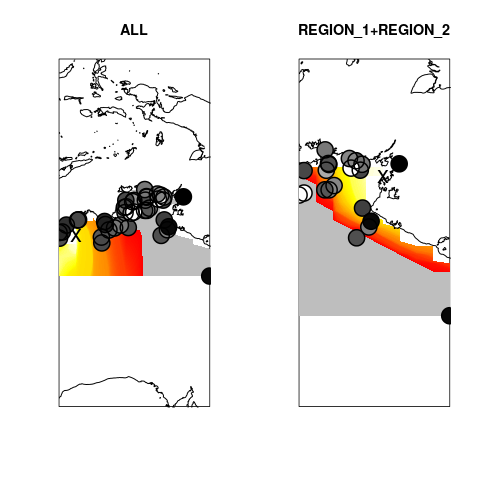

# Range Expansion analysis
####################################################
this package serves as an example on how to analyze
range expansion data, how to infer the origin and 
to infer the strength of the founder effect. Details
of the methods are found in Peter & Slatkin (2013), Evolution
and Peter & Slatkin (2015), Evolution

The major uses of the package are to either test
isolation-by-distance on some sets of populations, or
to infer the origin of an expansion, and possibly the
strength of a founder effect.

The current version uses the snpStats package from
Bioconductor to handle SNP data efficiently. See
http://www.bioconductor.org/packages/release/bioc/html/snpStats.html
on how to install it. In brief, you should be able to run
    source("http://bioconductor.org/biocLite.R")
    biocLite("snpStats")
    library(snpStats)

Other dependencies are `geosphere` for haversine distance, and 
`rworldmap` for plotting of a map

### File Format Descriptions & Modifiers
there are two required files, one file contains genetic data and one
containing location information.

 The data formats are the following:
###### snp file (bed format)
see http://pngu.mgh.harvard.edu/~purcell/plink2/formats.html
for reference. This file is perhaps easiest generated using
plink 1.9. For example, from vcf data, use

    plink --vcf my.vcf --set-missing-var-ids "@_#" --make-bed --out new --allow-extra-chr
to generate a bed file.
###### snp file (snapp format)
alternatively, data can be loaded using a similar format to the SNAPP
program. Here, each row is an individual, each column (comma delimited)
a SNP, except the first one, which gives the name of the individual.
Missing data is encoded as a `?`.
###### coords_file 
a tab-delimited file with a header (first row) 
and the following columns:
- id (or 1st column): is the id of the individual
- longitude: the longitude or x-coordinate of sample location
- latitude: the latitude or y-coordinate of the sample
- outgroup (optional): Whether the individual should be treated as an outgroup
to polarize SNP
- region (optional): In the case of multiple origins, this allows for an
factor for which individuals are included in a given run
- pop (optional): If custom population assignments are chosen, the 
value here assigns individuals to a population

### Pipeline Overview:
there are three main steps to this program: 
1. data is loaded from individuals, then population level
 data is generated from individual level data

2. After that, a directionalit statistc is calculated 
 for all pairs of populations, and a file with the 
 location for each population is generated. 

3. These population matrices are used for the actual inference

### Modelling decisions and options

###### Outgroups
Outgroup Individuals are individuals assumed to be ancestral to the population of interest.
Their alleles can be used to determine the most likely ancestral state of an allele.
######    Regions
Regions are sets of populations that can be analyzed independently, i.e. they correspond
to clusters that a priory are thought to have a different origin.
Each list entry corresponds to an analysis, i. e. the following command
will analyze the populations `REGION_1`, `REGION_2` and `REGION_3` individually, but will
also jointly analyze `REGION_1` and `REGION_2`. NULL corresponds to all
individuals analyzed

    regions_to_analyze <- list(NULL,
                               "REGION_1", 
                               "REGION_2", 
                               "REGION_3", 
                               c("REGION_1", "REGION_2"))

### calculation of ψ 
 
the script implents a basic pipeline from a genetic data
set to a graphical output. If you are only interested in
calculating the ψ statistic, use the `get_psi` function

the parameters for the function are:
    Parameters:                                        
        - fi : vector of int                           
             - vector of derived allele counts for each 
               snp in population i                    
        - fj : vector of int                           
             - vector of derived allele counts for each 
               snp in population j                    
        - ni : vector of int                           
             - vector of total number of genotypes in   
               population i                           
        - nj : vector of int                           
             - vector of total number of genotypes in   
               population j                           
         -n : the number of samples to downsample to    
all vectors have length equal to the number of snp

## Example analysis
#### Specify File Names
First, we need to specify the files we want to load

    snp.file <- "examples/example_snp.snapp
    coord.file <- "examples/example_coordinates.csv" 

We also need to specify the ploidy and which regions we want to analyze
Suppose we want to analyze all individuals, and those which we assigned
to individuals in "REGION_1", and "REGION_2":

    ploidy <- 2 #diploid individuals
    region <- list(NULL, 
                   c("REGION_1", "REGION_2"))

Since the coordination file is csv, we add the argument `sep=','`:

    raw.data <- load.data.snapp(snp.file, coord.file, sep=',', 
                                ploidy=ploidy)

Then, we calculate the population-level data from individual data
and calculate all pairwise statistics:

    pop <- make.pop(raw.data, ploidy)
    psi <- get.all.psi(pop)

Finally, we want to find the origins, using `run.regions`:

    results <- run.regions(region=region, pop=pop, xlen=10, ylen=20)

To analyze the results, we use the functions `summary` and `plot`:
`summary` gives a table with some statistcs, while plot gives a visual
representation of the results

#### Summary Function

running the summary in the example should give a result like this:

         |         ALL|REGION_1+REGION_2
-------- |---------:  | --------------:
longitude|    125.5317|         136.0681
latitude |   -16.41474|        -13.02342
q        |0.0006442162|     0.0005604015
r1       |   0.9987132|        0.9988805
r10      |   0.9872796|        0.9889162
r100     |   0.8858626|        0.8992156
d1       |    7.839768|         9.012298
rsq      |   0.2742461|       0.08137551
pval     |1.049256e-49|        0.2293561

- longitude/latitude are the coordinates of the most likely origin
- q is the strenght of the founder effect
- r1/r10/r100 is the decrease in diversity over 1/10/100 km
- rsq/pval are the correlation coefficient and correlation p-value for
the most likely origin

#### Plot Function
The plot function gives a visual representation of the results. The arguments
can be seen by typing `?plot.origin.results` on the R console. In brief,
a heatmap is generated where high (default: yellow) values indicate a likely origin (as measured
by the sum of squares deviation), low values(red) indicate an unlikely origin
and grey values indicate a negative correlation of diversity and an origin from
that location. If `add.map=T` a map is added to the plot. The sample
locations are added as circles, with colors measured as heterozygosities.
Light circles indicate high H, dark circles indicate low H.

